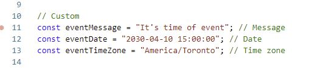
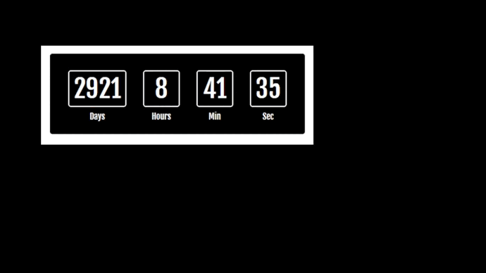

[](https://www.gnu.org/licenses/gpl-3.0.html)
[](https://www.gnu.org/licenses/gpl-3.0.html)

Countdown module, developped in ReactJS 18, Typescript 4.6, Sass 1.5<br />

You can report issues related to the game: [issues](https://github.com/delphinbock/countdown/issues)<br />

## Module



Customize the following constants in the file named "countDown.tsx"<br />

```javascript
const eventMessage = "It's time of event"; // Message
const eventDate = "2030-04-10 15:00:00"; // Date
const eventTimeZone = "America/Toronto"; // Time zone
```

